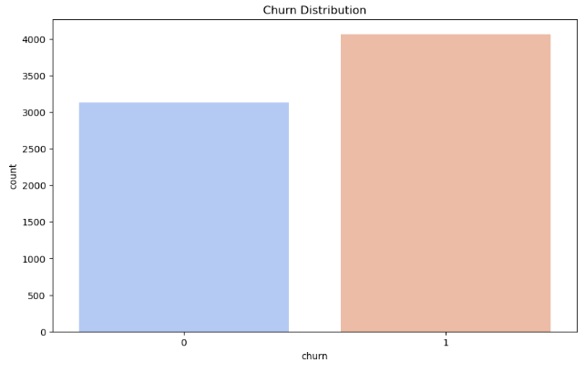
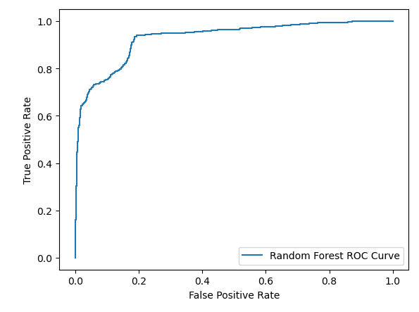
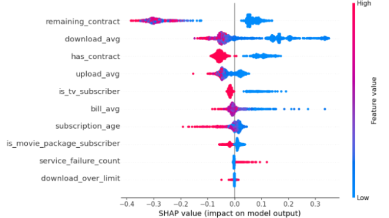

# 🧠 Customer Churn Prediction – Random Forest

Predicting customer churn for an Internet Service Provider using **Machine Learning (Random Forest Classifier)**.  
This project explores the data, builds a churn prediction model, tunes hyperparameters, and provides actionable **business insights** to reduce churn.

---

## 📌 Project Overview
Customer churn is a major concern for subscription-based businesses. 

In this project, we:
- Analyze customer behavior and service usage.
- Build and evaluate a **Random Forest model** to predict churn.
- Interpret model results using **SHAP** & **LIME**.
- Provide **business recommendations** to improve customer retention.

---

## 📊 Dataset

- **Source:** [Kaggle – Internet Service Churn Dataset](https://www.kaggle.com/datasets/mehmetsabrikunt/internet-service-churn/data)
- **Size:** 72,274 rows × 11 columns (sampled to ~7,200 rows for analysis)
- **Key Columns:**
  | Column | Description |
  |--------|-------------|
  | `id` | Subscriber ID |
  | `is_tv_subscriber` | TV subscription status |
  | `is_movie_package_subscriber` | Movie package subscription status |
  | `subscription_age` | Months of subscription |
  | `bill_avg` | Average bill (last 3 months) |
  | `remaining_contract` | Remaining years on contract (0 = no contract) |
  | `service_failure_count` | Service failures reported (last 3 months) |
  | `download_avg` | Avg. data downloaded (GB, last 3 months) |
  | `upload_avg` | Avg. data uploaded (GB, last 3 months) |
  | `download_over_limit` | Times user exceeded download limit (9 months) |
  | `churn` | Target — 1 = churned, 0 = retained |

---

## 🔬 Methodology

1. **Data Cleaning & Preprocessing**
   - Handled missing values (`remaining_contract`, `download_avg`, `upload_avg`).
   - Created new feature: `has_contract`.
   - Scaled numerical variables for model training.

2. **Exploratory Data Analysis (EDA)**
   - Analyzed churn distribution (56.5% churn rate).
   - Visualized feature correlations.
   - Identified key churn indicators.

3. **Modeling**
   - Baseline **Random Forest** Classifier.
   - **GridSearchCV** for hyperparameter tuning.
   - Evaluated using **recall** (priority) & accuracy.

4. **Model Interpretability**
   - Used **SHAP** for global feature importance.
   - Used **LIME** for local explanations.

5. **Business Insights**
   - Customers with **long contracts** are less likely to churn.
   - Low internet usage may indicate potential churn risk.
   - TV/movie package subscriptions correlate with retention.

---

## ⚙️ Installation & Setup

Clone this repository and install dependencies:

```bash
git clone https://github.com/YOUR_USERNAME/your-repo-name.git
cd your-repo-name
pip install -r requirements.txt
```

Make sure you have Python **3.8+**.

---

## 🚀 Usage

Run the notebook to reproduce the analysis:

```bash
jupyter notebook customer_churn_analysis.ipynb
```

Or run the Python script:

```bash
python churn_model.py
```

---

## 📈 Results

- **Initial Model Recall:** ~84%  
- **Optimized Model Recall (after GridSearch):** ~83% (slightly lower but more stable with cross-validation)

### 📊 Model Evaluation
Here’s the ROC curve for the optimized Random Forest model:


- **Top Features Impacting Churn:**



Example feature importance (SHAP):

```
remaining_contract  ↓ (long contracts reduce churn)
download_avg        ↓ (higher usage = lower churn)
has_contract        ↓
```

---

## 💡 Business Recommendations
- Encourage **long-term contracts** with discounts or perks.
- Offer **premium streaming bundles** to retain customers.
- Target **low-usage customers** with engagement campaigns.
- Monitor contract expiration and proactively offer renewals.

---

## 🔮 Future Improvements
- Train on the **full dataset** for better performance.
- Address **class imbalance** with SMOTE or class weights.
- Try other models (e.g., XGBoost, LightGBM).
- Deploy with **MLOps tools** (e.g., Azure ML, AWS SageMaker).
- Build a **real-time churn dashboard** for the business team.

---

## 🛠️ Tech Stack
- **Python:** pandas, numpy, matplotlib, seaborn
- **ML:** scikit-learn, RandomForestClassifier
- **Model Explainability:** SHAP, LIME
- **Visualization:** seaborn, matplotlib
- **Environment:** Jupyter Notebook

---

## 📚 References
- [Kunt, M.S. – Internet Service Churn Dataset (Kaggle)](https://www.kaggle.com/datasets/mehmetsabrikunt/internet-service-churn/data)
- [Yadav, A. – Building a Churn Prediction Model (Medium)](https://medium.com/biased-algorithms/building-a-churn-prediction-model-e8558add21a4)
- Yocupicio-Zazueta et al. (2024). *Design and Deployment of ML in CRM to Identify Leads*. Applied Artificial Intelligence.

---

## 👩‍💻 Author
**Camilla Naomy Tsuda**  
Higher Diploma in Data Analytics  
